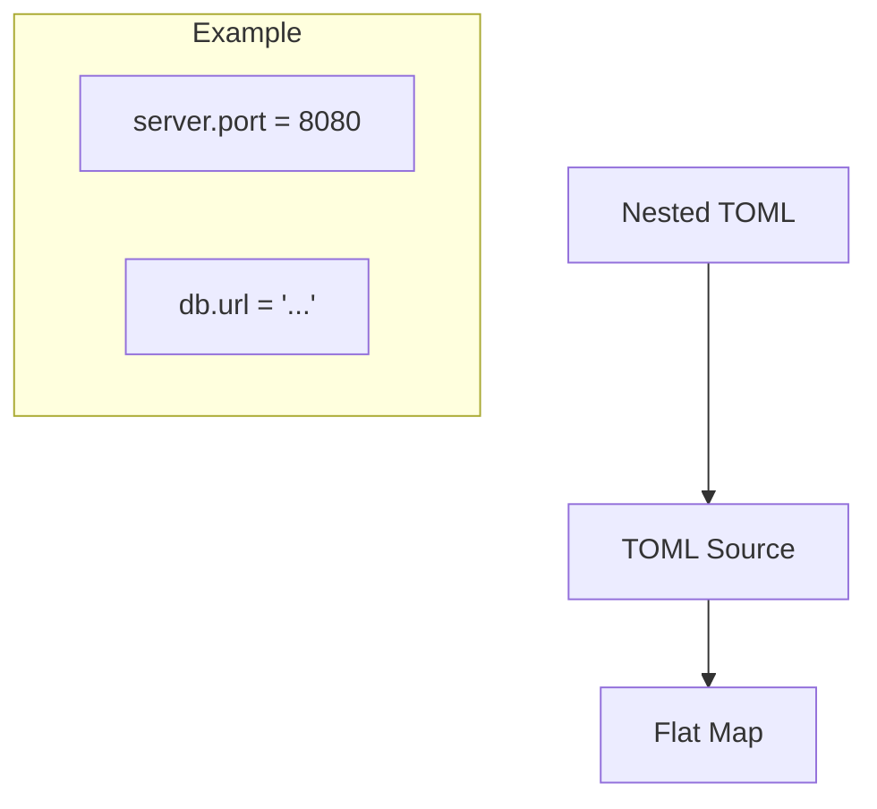

# 📄 Config Source: TOML

The foundational configuration source. It reads static TOML files (e.g., `config/default.toml`) to establish the application's base settings.

---

## 🛠️ Data Flattening

---

## 🔑 Key Features

- **Structured Defaults**: Best for complex, hierarchical configuration structures.
- **Local Caching**: Can be bundled with the binary for air-gapped deployments.
- **Comments Support**: Enables documented configuration files.

---

[🏠 Hub](../../../../docs/HUB.md) | [📡 Back to Sources Main](../README.md) | [🔝 Top](#-config-source-toml)
