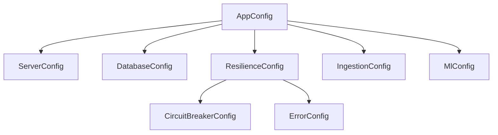

# 🧬 Configuration: Types

The domain models for application settings. This module contains strictly typed structs that mirror the application's hierarchical configuration structure.

---

## 🏗️ Type Hierarchy

---
[⬅️ Back to Config Main](../README.md)
