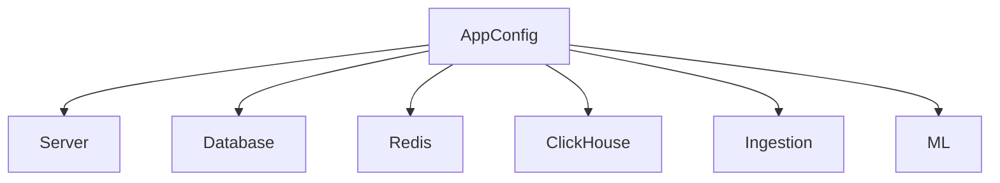

# 🏗️ Config Type: App

The root configuration structure. `AppConfig` is the single source of truth for the entire application, aggregating all domain-specific settings into a unified, immutable object.

---

## 🏗️ Aggregation Model

---
[⬅️ Back to Types Main](../README.md)
