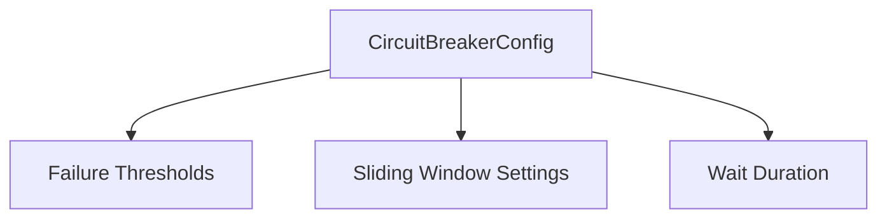

# 🛡️ Config Type: Circuit Breaker

Detailed parameters for the Hystrix-style resilience layer. Defines failure thresholds, window sizes, and state transition timeouts.

---

## 🏗️ Breaker Parameters

---
[⬅️ Back to Types Main](../README.md)
