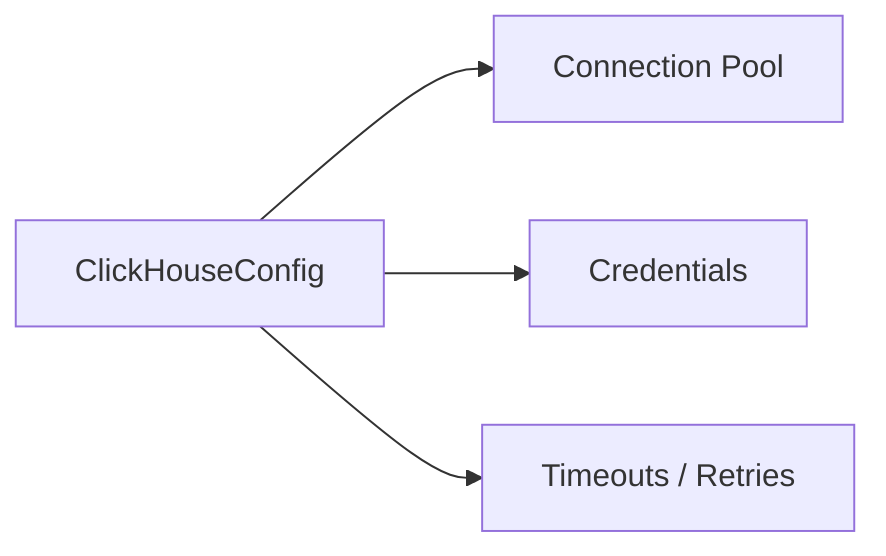

# 📊 Config Type: ClickHouse

Settings for the ClickHouse OLAP database integration. Used for high-volume analytics, long-term interaction storage, and performance monitoring.

---

## 🏗️ Configuration Surface

---
[⬅️ Back to Types Main](../README.md)
