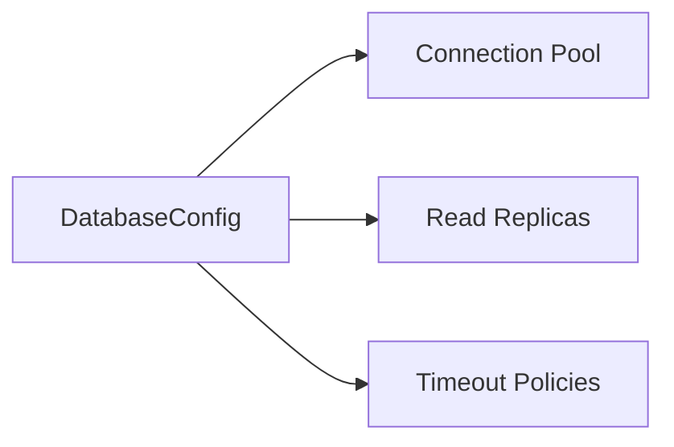

# 🗄️ Config Type: Database

PostgreSQL connection settings. Manages connection pooling, read replicas, and transaction timeouts for the relational storage layer.

---

## 🏗️ Persistence Layer

---
[⬅️ Back to Types Main](../README.md)
