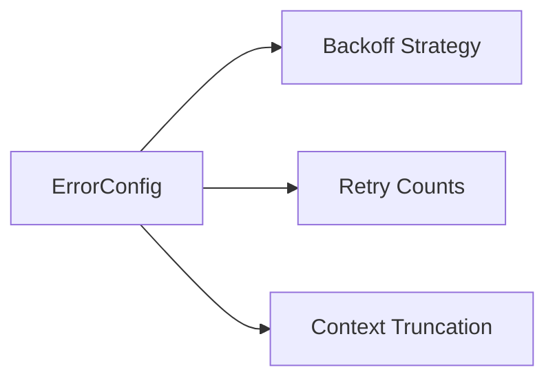

# ⚠️ Config Type: Error

Defines global error handling and recovery strategies. Controls backoff algorithms, retry limits, and error context preservation policies.

---

## 🏗️ Recovery Strategy

---

[🏠 Hub](../../../../docs/HUB.md) | [🧬 Back to Types Main](../README.md) | [🔝 Top](#️-config-type-error)
