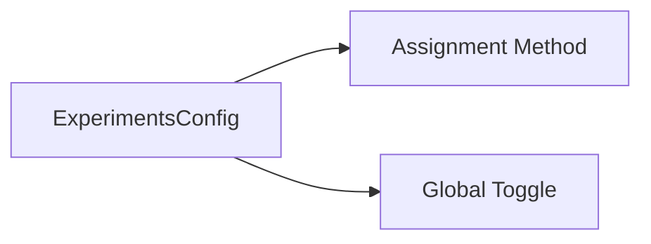

# 🧪 Config Type: Experiments

Settings for A/B testing and dynamic feature flags. Controls assignment methods and global enablement for the experimentation framework.

---

## 🏗️ Experimentation Plane

---

[🏠 Hub](../../../../docs/HUB.md) | [🧬 Back to Types Main](../README.md) | [🔝 Top](#-config-type-experiments)
