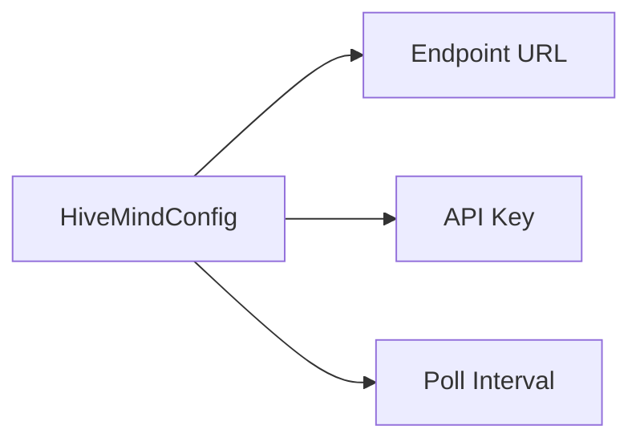

# 🐝 Config Type: Hive Mind

Configuration for the AI-driven global optimization network. Defines connection parameters for central intelligence synchronization and rule auto-approval policies.

---

## 🏗️ Hive Mind Connectivity

---

[🏠 Hub](../../../../docs/HUB.md) | [🧬 Back to Types Main](../README.md) | [🔝 Top](#-config-type-hive-mind)
