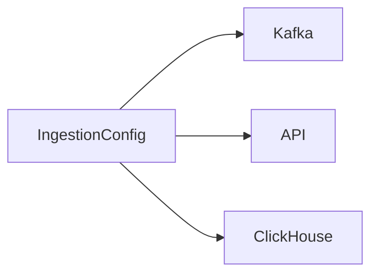

# 📥 Config Type: Ingestion

Defines parameters for the activity ingestion pipeline, including buffer sizes, processing timeouts, and source-specific settings for API and ClickHouse.

---

## 🏗️ Ingestion Structure

---

[🏠 Hub](../../../../docs/HUB.md) | [🧬 Back to Types Main](../README.md) | [🔝 Top](#-config-type-ingestion)
