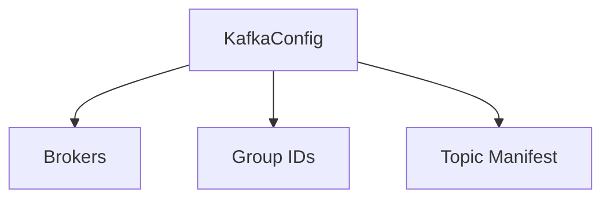

# 🏗️ Config Type: Kafka

Communication settings for distributed stream processing. Defines broker addresses, consumer groups, and topic mappings for all user interaction streams.

---

## 🏗️ Stream Topography

---
[⬅️ Back to Types Main](../README.md)
