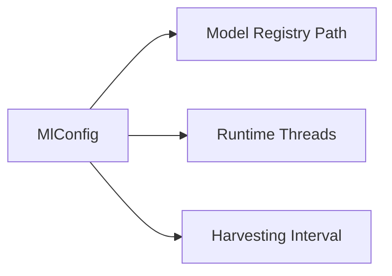

# 🧠 Config Type: ML

Settings for machine learning model management and inference. Controls model loading paths, ONNX runtime parameters, and training orchestrator behavior.

---

## 🏗️ ML Infrastructure

---

[🏠 Hub](../../../../docs/HUB.md) | [🧬 Back to Types Main](../README.md) | [🔝 Top](#-config-type-ml)
