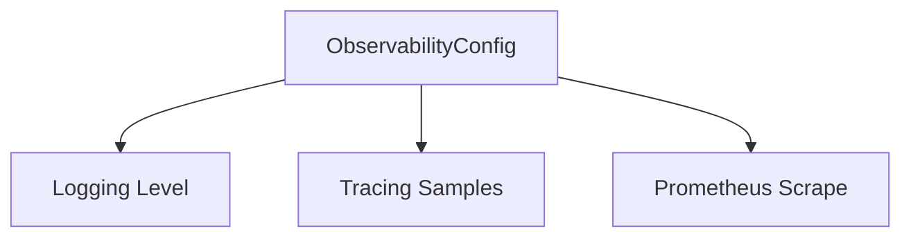

# 📡 Config Type: Observability

Global settings for tracing, logging, and metrics. Controls the verbosity and destination of system visibility data.

---

## 🏗️ Observability Stack

---

[🏠 Hub](../../../../docs/HUB.md) | [🧬 Back to Types Main](../README.md) | [🔝 Top](#-config-type-observability)
