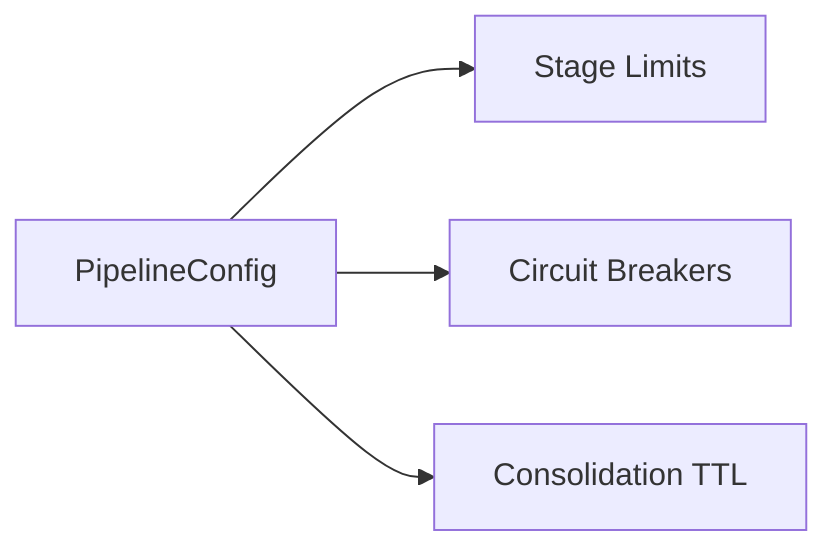

# 🏗️ Config Type: Pipeline

Orchestration settings for the recommendation execution engine. Controls stage behavior, thundering herd protection, and pipeline-level circuit breaking.

---

## 🏗️ Engine Pipeline

---

[🏠 Hub](../../../../docs/HUB.md) | [🧬 Back to Types Main](../README.md) | [🔝 Top](#️-config-type-pipeline)
