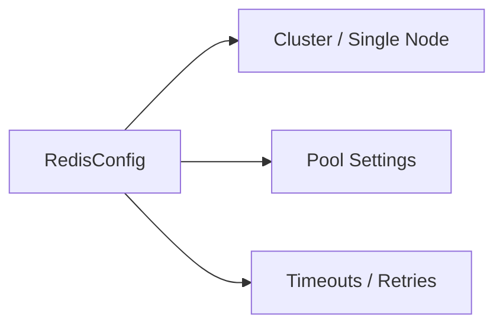

# 🗄️ Config Type: Redis

Settings for the L2 distributed cache and rate limiting layer. Controls connection pooling, cluster mode, and request-level timeouts.

---

## 🏗️ Redis Integration

---

[🏠 Hub](../../../../docs/HUB.md) | [🧬 Back to Types Main](../README.md) | [🔝 Top](#️-config-type-redis)
