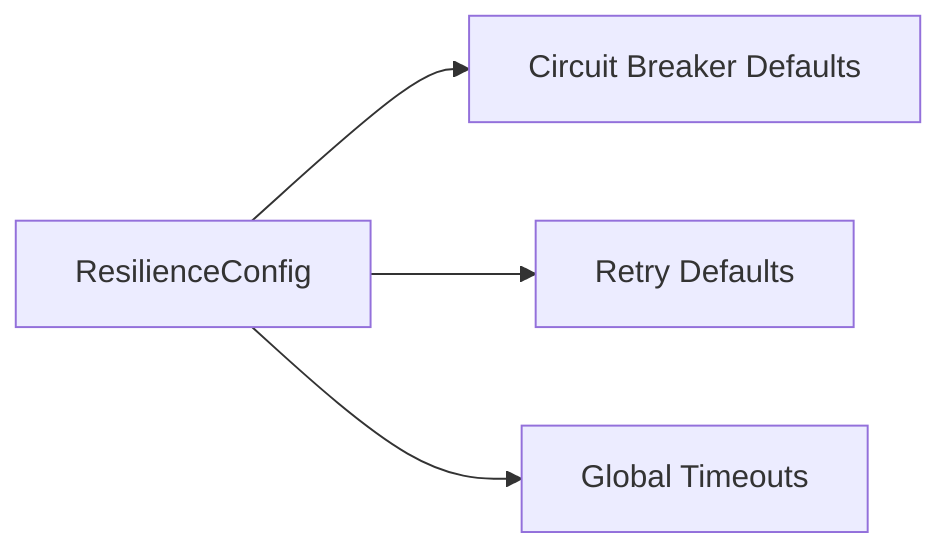

# 🏗️ Config Type: Resilience

Orchestrates the global defaults for the composite resilience pattern. Combines circuit breaker, retry, and timeout settings into a unified profile.

---

## 🏗️ Resilience Aggregation

---

[🏠 Hub](../../../../docs/HUB.md) | [🧬 Back to Types Main](../README.md) | [🔝 Top](#️-config-type-resilience)
