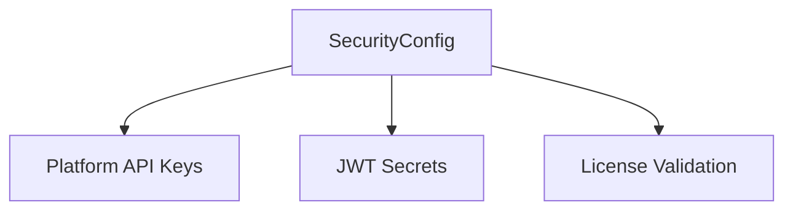

# 🛡️ Config Type: Security

Manages sensitive security parameters, including API keys for various platforms (Web, Mobile, TV), JWT secret keys, and license validation server URLs.

---

## 🏗️ Security Perimeter

---

[🏠 Hub](../../../../docs/HUB.md) | [🧬 Back to Types Main](../README.md) | [🔝 Top](#️-config-type-security)
