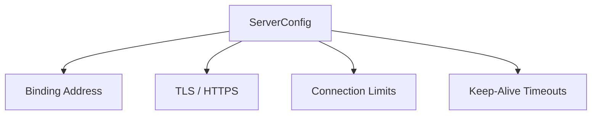

# 🌐 Config Type: Server

Core web server settings for the Axum-based API. Handles host/port binding, TLS certificates, and connection keep-alive policies.

---

## 🏗️ Server Parameters

---
[⬅️ Back to Types Main](../README.md)
