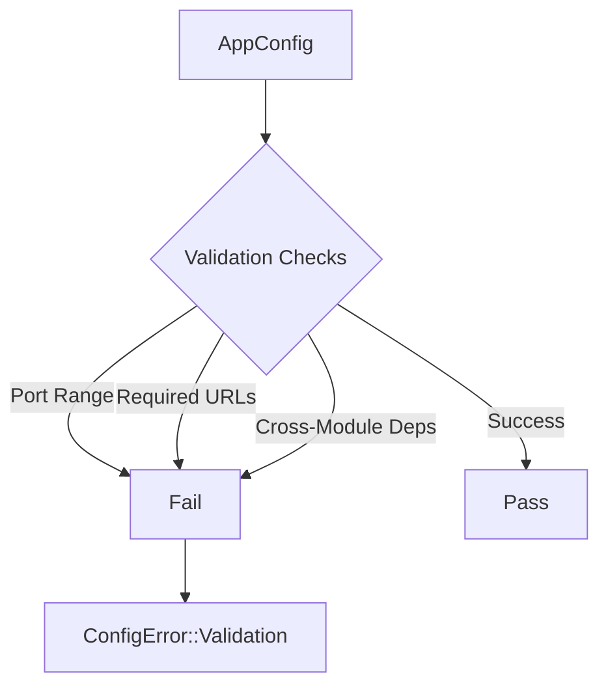

# 🛡️ Configuration: Validation

Ensures that the loaded configuration is semantically correct and that cross-module dependencies are satisfied. This prevents the application from starting in an inconsistent state.

---

## 🏗️ Validation Logic

---

[🏠 Hub](../../../docs/HUB.md) | [⚙️ Back to Config Main](../README.md) | [🔝 Top](#️-configuration-validation)
