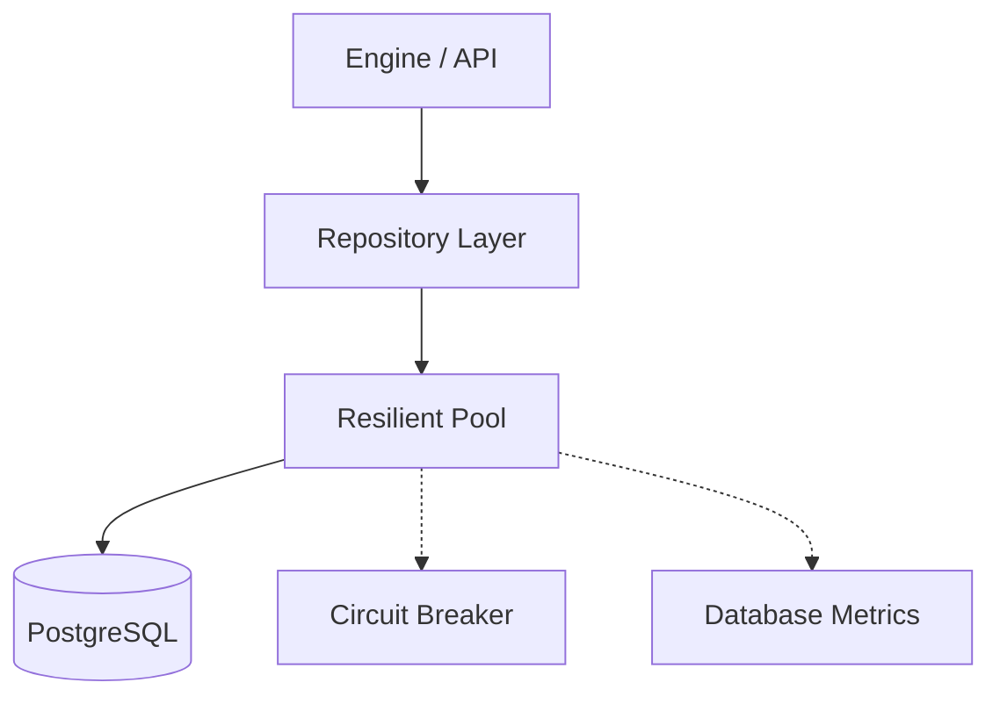

# 🗄️ Database Layer Module

> **Resilient persistence and high-performance data access layer.**

The Database module provides a robust interface to PostgreSQL, featuring resilient connection pooling with circuit breaker protection and a clean repository pattern for domain data access.

---

## 🏗️ Architecture Overview



---

## 🧩 Sub-Modules

| Module | Description |
| :--- | :--- |
| [**🏢 Pool**](./pool/README.md) | Resilient connection pooling with circuit breaking. |
| [**📦 Repositories**](./repositories/README.md) | Domain-specific data access implementations. |
| [**📊 Metrics**](./metrics/README.md) | Real-time database performance observability. |
| [**🧬 Models**](./models/README.md) | Internal database entity definitions. |

---

## 🚀 Quick Start

```rust
use db::ResilientPool;

let pool = ResilientPool::from_pool(sqlx_pool, config, cb_registry)?;

// Repositories use the resilient pool
let repo = ScenarioRepository::new(pool, metrics);
```

---

[🏠 Hub](../../docs/HUB.md) | [🔝 Top](#️-database-layer-module)
