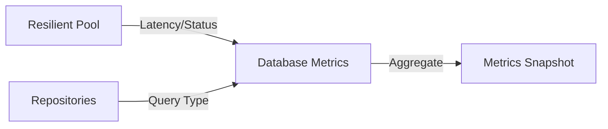

# 📊 Database: Metrics

Provides deep visibility into database performance, including query latencies, pool utilization, and error rates per repository.

---

## 🏗️ Monitoring Architecture

---

[🏠 Hub](../../../docs/HUB.md) | [📦 Back to Database Main](../README.md) | [🔝 Top](#-database-metrics)
