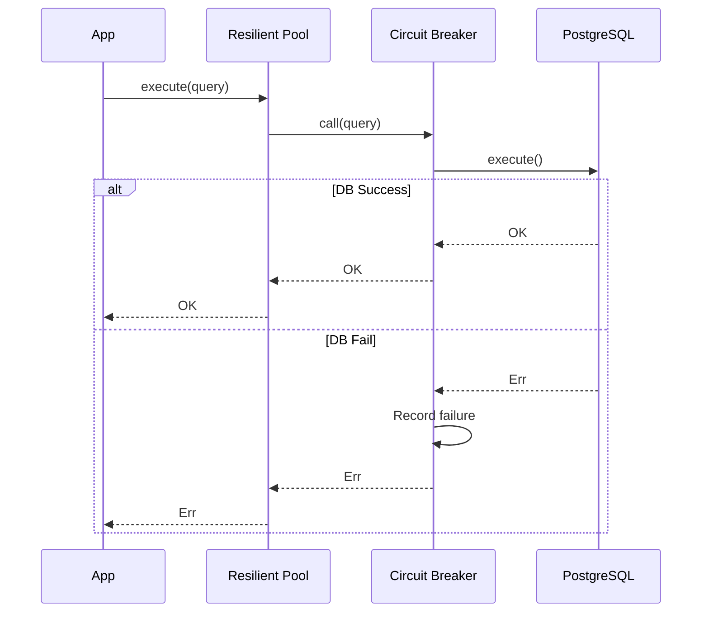

# 🏢 Database: Resilient Pool

Wraps `sqlx::Pool` with a circuit breaker to provide fast-fail capabilities when the database is overloaded or unavailable.

---

## 🛠️ Execution Flow

---
[⬅️ Back to Database Main](../README.md)
