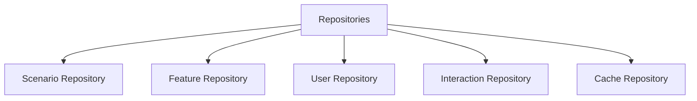

# 📦 Database: Repositories

Implements the Repository Pattern to decouple business logic from raw SQL queries. Each repository handles a specific domain entity.

---

## 🏗️ Repository Hierarchy

---
[⬅️ Back to Database Main](../README.md)
