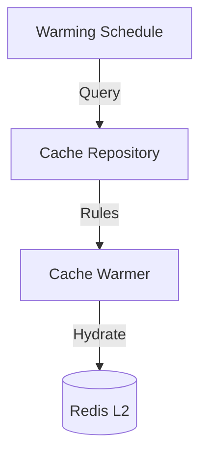

# 🗄️ Database Repository: Cache

> **Persistence for long-term cache metadata and pre-warming schedules.**

While the actual cached items live in Redis (L2), the `cache_repository` manages the persistent metadata, warming rules, and hydration schedules that drive the `PredictiveWarmer`.

---

## 🏗️ Hydration Logic

---

## 📄 Cache Payloads

Uses the `CacheEntryPayload` DTO to manage the synchronization of recommendation results between memory tiers and the system-of-record.

---

[🏠 Hub](../../../../docs/HUB.md) | [📦 Back to Database Main](../README.md) | [🔝 Top](#️-database-repository-cache)
