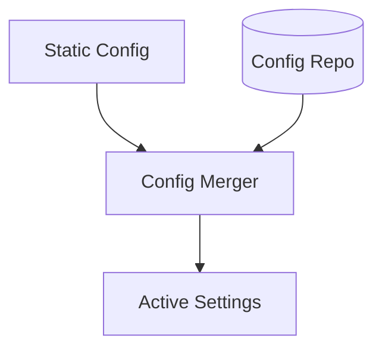

# ⚙️ Database Repository: Configuration

> **Persistent storage for dynamic system overrides.**

Used to store configuration values that can be changed at runtime via the API or Admin UI, allowing for fine-tuning of system behavior (e.g., circuit breaker thresholds) without a code deployment.

---

## 🏗️ Override Mechanism

---
[⬅️ Back to Repositories Main](../README.md)
