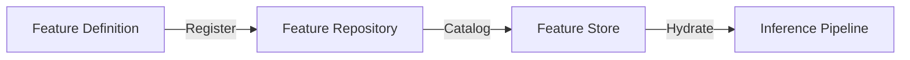

# 💎 Database Repository: Feature

> **Management of the ML feature catalog and metadata.**

Defines what features are available in the system, their data types, and their sources. This repository drives the UI for the Feature Store introspection and the validation logic during model training.

---

## 🏗️ Feature Lifecycle

---
[⬅️ Back to Repositories Main](../README.md)
