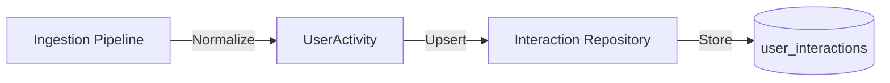

# 🖱️ Database Repository: Interaction

> **High-throughput storage for user interaction events.**

This repository is the primary sink for the ingestion pipeline. it records every click, impression, and playback session, providing the raw data needed for both real-time personalization and offline model training.

---

## 🏗️ Ingestion Flow

---

[🏠 Hub](../../../../docs/HUB.md) | [📦 Back to Database Main](../README.md) | [🔝 Top](#️-database-repository-interaction)
