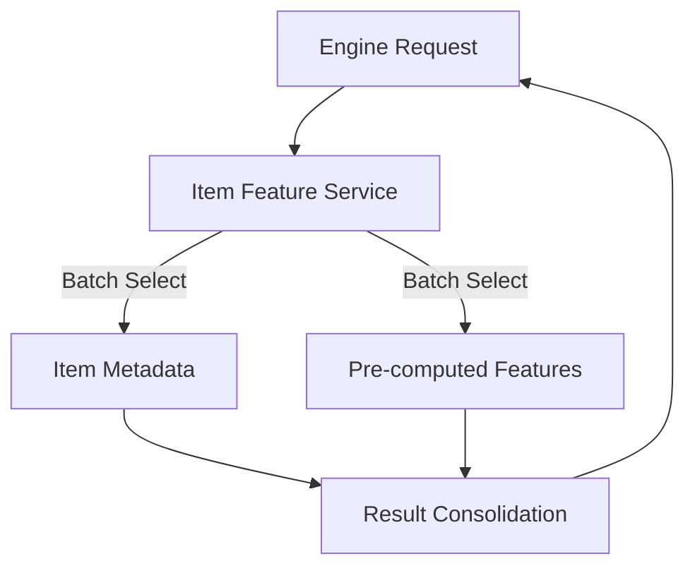

# 🛠️ Database Service: Item Feature

> **High-performance service for retrieving combined item and feature data.**

A specialized service repository that provides optimized queries for fetching large batches of item metadata and pre-computed features required for the "Heavy Ranker" stages of the recommendation pipeline.

---

## 🏗️ Data Aggregation

---
[⬅️ Back to Repositories Main](../README.md)
