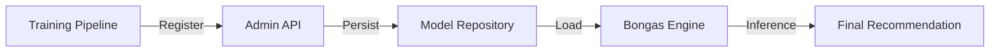

# 🧠 Database Repository: Model

> **Persistence and metadata management for ONNX machine learning models.**

The `model_repository` handles the storage and retrieval of model metadata, versioning, and deployment status. It ensures the engine can always find and load the correct weights for inference.

---

## 🏗️ Model Management Flow

---
[⬅️ Back to Repositories Main](../README.md)
