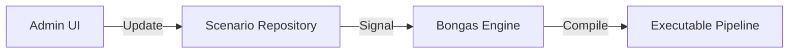

# 🎬 Database Repository: Scenario

> **Storage and versioning for recommendation pipeline definitions.**

The `scenario_repository` is the source of truth for all recommendation logic. It persists the JSON-based pipeline definitions that are hot-reloaded by the engine to change recommendation behavior instantly.

---

## 🏗️ Hot-Reload Cycle

---

[🏠 Hub](../../../../docs/HUB.md) | [📦 Back to Database Main](../README.md) | [🔝 Top](#-database-repository-scenario)
