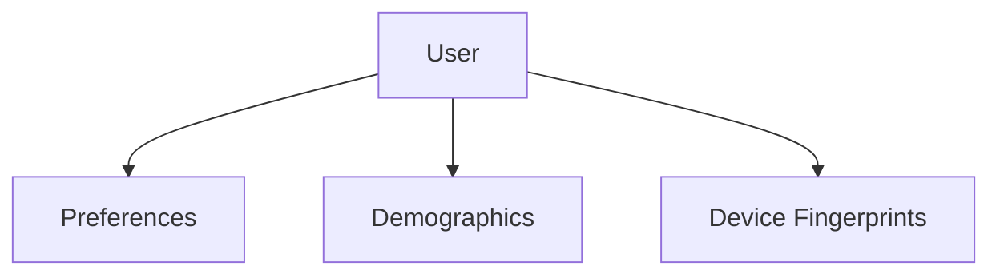

# 👤 Database Repository: User

> **User profile management and device fingerprint mapping.**

Handles the storage of user metadata, preferences, and demographics. It also manages the mapping between users and their various device fingerprints for security and personalization consistency.

---

## 🏗️ Profile Graph

---
[⬅️ Back to Repositories Main](../README.md)
