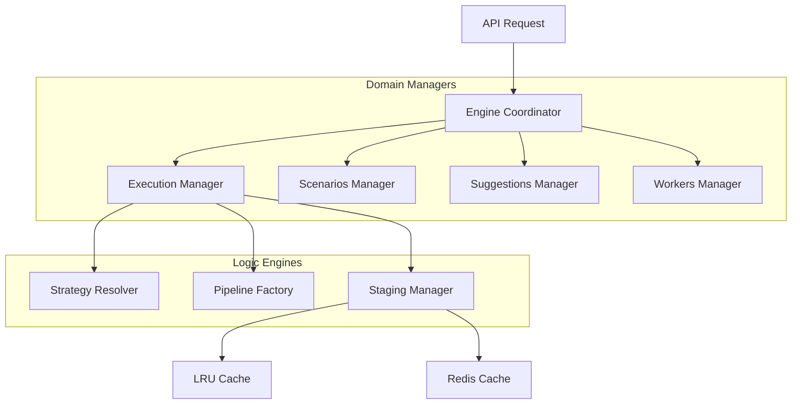

# 🧠 Engine Layer Module

> **The central intelligence and coordination backbone of BONGAS-AI.**

The Engine module is the heart of the recommendation system. It orchestrates the entire request lifecycle—from strategic rule resolution and high-performance execution to real-time cache invalidation and AI-driven rule suggestions.

---

## 🏗️ Architecture Overview



---

## 🧩 Sub-Modules

### 🏛️ Coordination & Lifecycle

| Module | Description |
| :--- | :--- |
| [**🏛️ Engine**](./engine/README.md) | The grand coordinator and system runtime state. |
| [**🚀 Runtime**](./runtime/README.md) | Top-level application bootstrap and run-loop. |
| [**⚙️ Config**](./config/README.md) | Engine dependency injection and boot parameters. |

### 🛠️ Domain Managers

| Module | Description |
| :--- | :--- |
| [**⚡ Execution**](./execution_manager/README.md) | High-performance recommendation execution loop. |
| [**🎬 Scenarios**](./scenarios_manager/README.md) | Lifecycle management and governance for pipelines. |
| [**🤖 Suggestions**](./suggestions_manager/README.md) | AI Assistant and strategic rule generation. |
| [**💓 Workers**](./workers_manager/README.md) | Background pulse and maintenance orchestration. |

### 🧠 Core Engines

| Module | Description |
| :--- | :--- |
| [**🌲 Strategy Resolver**](./strategy_resolver/README.md) | Dynamic contextual routing and rule matching. |
| [**🏭 Scenario Factory**](./scenario_factory/README.md) | Pipeline compilation and assembly logic. |
| [**🗄️ Staging Manager**](./staging_manager/README.md) | L2 Cache orchestration and thundering herd protection. |
| [**🔄 Staleness Engine**](./staleness_engine/README.md) | Real-time event-driven cache invalidation. |

### 📡 Intelligence & Connectivity

| Module | Description |
| :--- | :--- |
| [**🏎️ Analytics Sidecar**](./analytics_sidecar/README.md) | Real-time performance optimization unit. |
| [**🐝 Hive Mind**](./hive_mind/README.md) | Global intelligence synchronization layer. |
| [**☀️ Predictive Warmer**](./predictive_warmer/README.md) | Proactive cache hydration service. |
| [**🧬 Context**](./context/README.md) | Shared request-scoped execution state. |

---

## 🚀 Quick Start

```rust
let engine = engine::BongasEngine::bootstrap(deps).await?;

// Execute a recommendation scenario
let recommendations = engine.execute_scenario("home_feed", user_id, context).await?;
```

---
[🏠 Back to Project Root](../../README.md)
