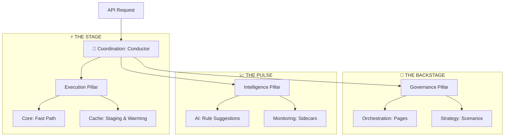

# 🧠 Engine: The Discovery Brain

The Engine module is the central intelligence and coordination backbone of BONGAS-AI. It follows an audience-based functional pillar architecture, strictly separating real-time execution from system governance and asynchronous intelligence.

---

## 🏗️ Architecture Overview

The Engine is organized into three primary pillars, orchestrated by **The Conductor**.



---

## 🏛️ Functional Pillars

### [⚡ THE STAGE (Execution)](./execution/README.md)

The high-performance discovery path optimized for zero-latency scenario resolution and parallel streaming.

- **Core**: Real-time execution loop and strategy resolver.
- **Cache**: Predictive warming and tiered staging (L1/L2).
- **Runtime**: Context management and request-scoped state.

### [🔐 THE BACKSTAGE (Governance)](./governance/README.md)

The administrative control plane for discovery rules, layouts, and orchestration.

- **Orchestration**: Page layouts and navigation mesh.
- **Strategy**: Scenario definitions and rule matching.
- **Factory**: Dynamic pipeline compilation and lifecycle.

### [📈 THE PULSE (Intelligence)](./intelligence/README.md)

Self-optimizing feedback loops and AI-driven insights that refine the engine's behavior.

- **AI**: Strategic rule generation and Hive Mind synchronization.
- **Monitoring**: Performance sidecars and staleness tracking.
- **Workers**: Background maintenance and orchestrated pulse.

### [🎼 THE CONDUCTOR (Coordination)](./coordination/README.md)

The assembly point that wires the three pillars into a unified `BongasEngine`.

---

## 🚀 Usage

```rust
// The Symphony factory handles the complex wiring of all three pillars
let symphony = DiscoverySymphony::new(config);
let engine = symphony.assemble().await?;

// Execute high-throughput discovery using the consolidated ExecutionContext
let ctx = ScenarioExecutionContext {
    scenario_slug: "home_feed".to_string(),
    user_id: Some(123),
    profile_id: Some("kids".to_string()),
    ..Default::default()
};

let (items, stats) = engine.execute_scenario_with_stats_contextual(ctx).await?;
```

---

[🏠 Hub](../../docs/HUB.md) | [🔝 Top](#-engine-the-discovery-brain)
