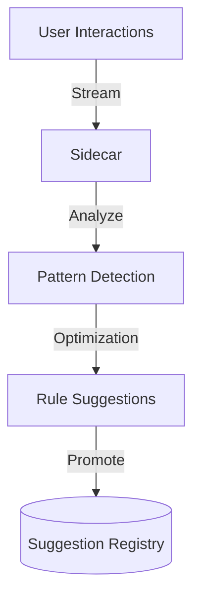

# 🏎️ Engine: Analytics Sidecar

> **Real-time optimization intelligence for the recommendation loop.**

The Analytics Sidecar is a background intelligence unit that monitors system performance and user interaction patterns. It autonomously generates rule suggestions to optimize Click-Through Rates (CTR) and catalog coverage.

---

## 🏗️ Intelligence Flow

---

## 🔑 Key Features

- **Autonomous Discovery**: Identifies high-performing item clusters for specific segments.
- **Low-Latency Analysis**: Runs out-of-band to ensure zero impact on request latency.
- **Feedback Loop**: Continuously validates the impact of approved suggestions.

---
[⬅️ Back to Engine Main](../README.md)
