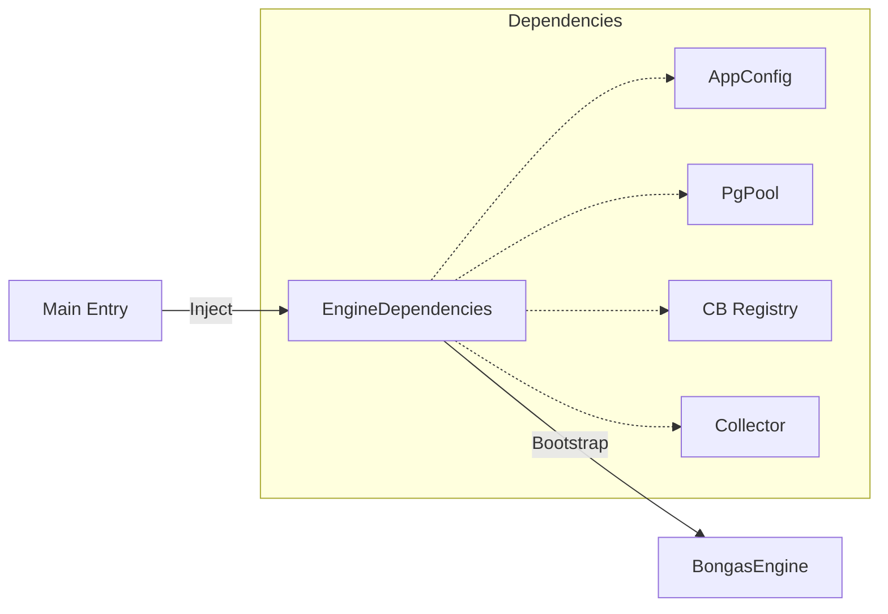

# ⚙️ Engine: Config

Defines the core dependencies required to bootstrap and run the `BongasEngine`. This module acts as the contract between the main application entry point and the engine runtime.

---

## 🏗️ Dependency Injection

---
[⬅️ Back to Engine Main](../README.md)
