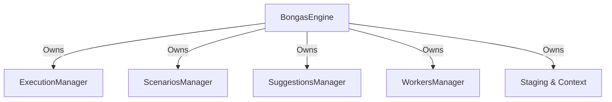

# 🏛️ Engine: Coordinator

The central assembly point for the BONGAS-AI system. The `BongasEngine` struct acts as the grand coordinator, holding references to all domain managers and delegating logic to specialized sub-modules.

---

## 🏗️ Orchestration Topology

---

## 🔑 Key Features

- **Unified State**: Centralized storage for all Arc-wrapped service dependencies.
- **Async Runtime**: Built-in support for background worker spawning and task tracking.
- **Graceful Shutdown**: Coordinates system-wide signal broadcasting for clean exits.

---
[⬅️ Back to Engine Main](../README.md)
