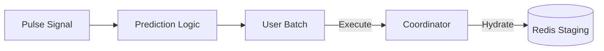

# ☀️ Engine: Predictive Warmer

Proactively hydrates the cache by anticipating user needs. It uses historical interactions and popularity signals to execute and stage recommendations before the user even lands on the home feed.

---

## 🏗️ Warming Cycle

---

## 🔑 Key Features

- **Cold-Start Elimination**: Drastically reduces P99 latency for returning users.
- **Smart Batching**: Prioritizes warming for high-traffic scenarios.
- **Resource Aware**: Throttles warming operations during peak API load to protect system throughput.

---
[⬅️ Back to Engine Main](../README.md)
