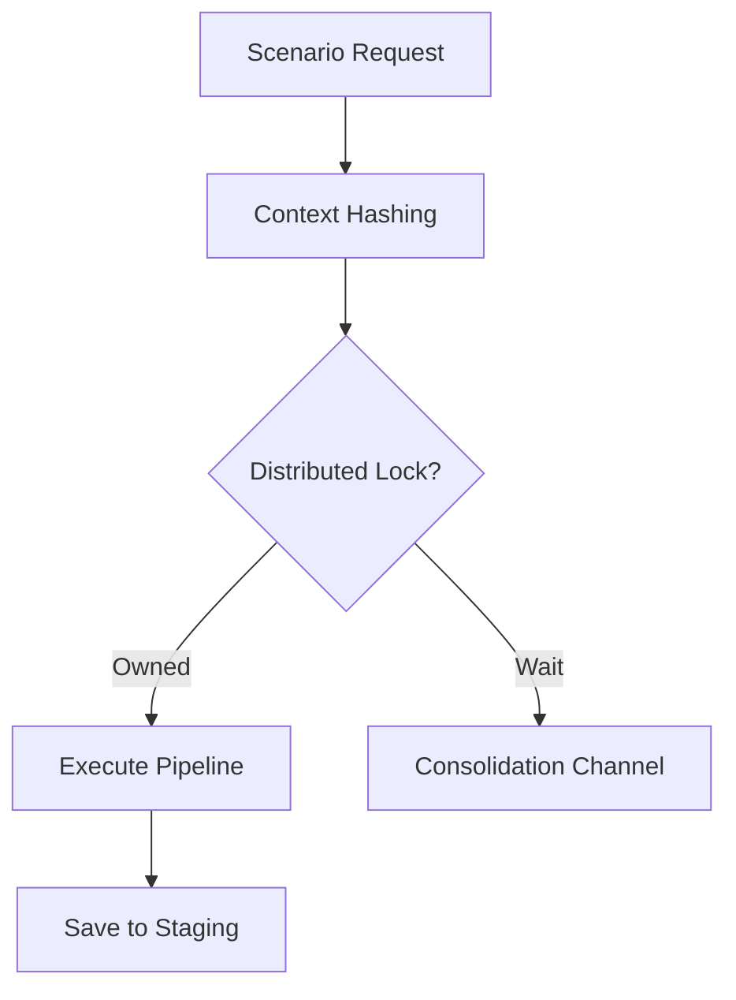

# 🗄️ Engine: Staging Manager

Manages the orchestration of the L2 (Redis) cache and provides synchronization primitives to prevent redundant compute operations.

---

## 🏗️ Caching & Locking

---

## 🔑 Key Features

- **Context Hashing**: Generates unique keys based on user ID and persona metadata.
- **Thundering Herd Protection**: Uses a shared broadcast system to consolidate concurrent requests for the same content.
- **Atomic Staging**: Ensures cache population is race-free.

---
[⬅️ Back to Engine Main](../README.md)
