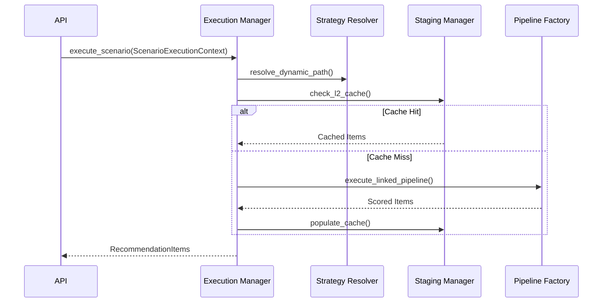

# ⚡ Engine: Execution Manager

The high-performance core of the engine. It is responsible for the end-to-step execution of recommendation pipelines, including strategic path resolution and thundering herd protection.

---

## 🌊 Request Flow

---

[🏠 Hub](../../../../../docs/HUB.md) | [⚡ Core Main](../README.md) | [🔝 Top](#-engine-execution-manager)
