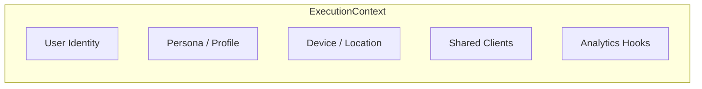

# 🧬 Engine: Execution Context

Defines the `ExecutionContext`, a thread-safe container that carries all necessary state, dependencies, and session-specific metadata through the recommendation pipeline.

---

## 🏗️ Context Anatomy

---

## 🔑 Key Features

- **Dependency Injection**: Provides stages access to Redis, ClickHouse, and ML models.
- **Request Tracing**: Carries a unique `request_id` for end-to-end observability.
- **Persona Isolation**: Ensures maturity ratings and profile-specific filters are strictly enforced.

---

[🏠 Hub](../../../../../docs/HUB.md) | [⚡ Runtime Main](../README.md) | [🔝 Top](#-engine-execution-context)
