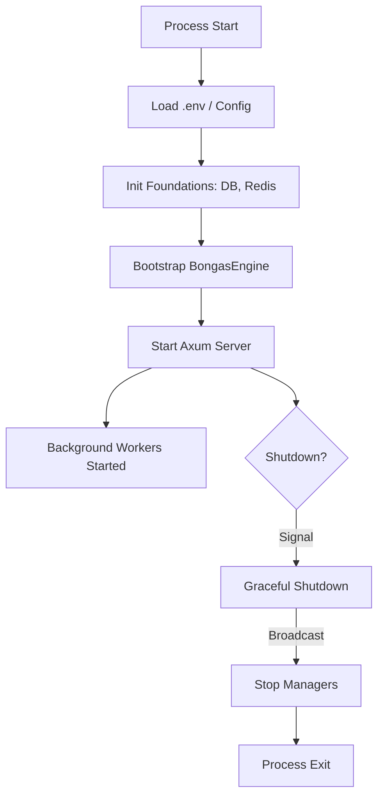

# 🚀 Engine: Runtime

The `runtime` module manages the top-level lifecycle of the entire application process. It is responsible for orchestrating the transition from initial boot to a fully operational serving state.

---

## 🏗️ Execution Lifecycle

---

## 🔑 Key Features

- **Concurrent Init**: Highly parallelized initialization of independent subsystems.
- **Signal Handling**: Built-in support for SIGINT/SIGTERM for clean resource cleanup.
- **State Assembly**: Coordinates the wiring between the Coordinator and its Managers.

---

[🏠 Hub](../../../../../docs/HUB.md) | [⚡ Runtime Main](../README.md) | [🔝 Top](#-engine-runtime)
