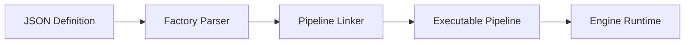

# 🏭 Engine: Scenario Factory

Responsible for the compilation and assembly of executable pipelines. It transforms static database definitions into highly-optimized, linked execution graphs.

---

## 🏗️ Compilation Lifecycle

---

## 🔑 Key Features

- **Schema Validation**: Ensures pipeline stages are valid and correctly ordered.
- **Dynamic Linking**: Hot-swaps model weights and stage logic without system restarts.
- **Dependency Resolution**: Wires required shared services into every executable stage.

---
[⬅️ Back to Engine Main](../README.md)
