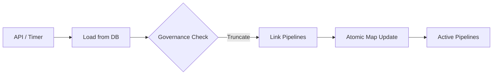

# 🎬 Engine: Scenarios Manager

Manages the lifecycle of recommendation scenarios. This includes loading pipeline definitions from the database, compiling them into executable forms, and enforcing governance limits on the number of active scenarios.

---

## 🔄 Hot-Reload Lifecycle

---
[⬅️ Back to Engine Main](../README.md)
