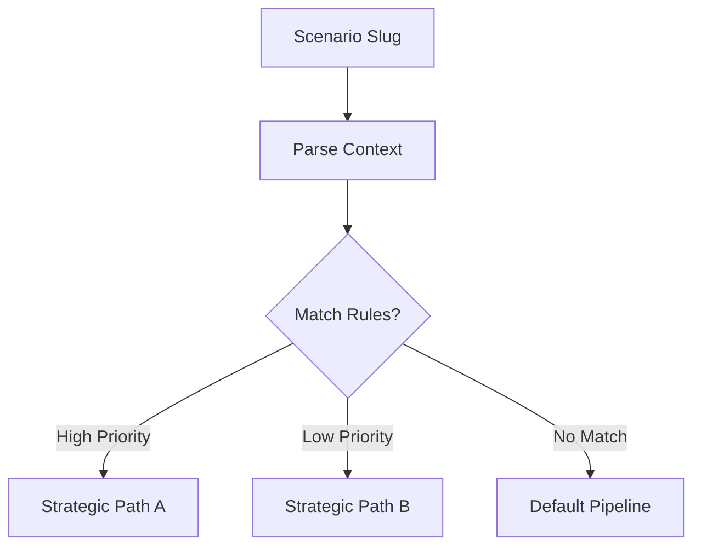

# 🌲 Engine: Strategy Resolver

The decision engine for contextual routing. It evaluates the current `ExecutionContext` against a set of active strategic rules to determine the optimal execution path.

---

## 🏗️ Resolution Tree

---

## 🔑 Key Features

- **Persona Routing**: Changes behavior based on `device_type`, `region`, or `maturity_rating`.
- **Conflict Resolution**: Uses a priority-based system to handle multiple matching rules.
- **High Performance**: Evaluates complex rule-sets in < 1ms using pre-compiled predicates.

---

[🏠 Hub](../../../../../docs/HUB.md) | [🎬 Strategies Main](../README.md) | [🔝 Top](#-engine-strategy-resolver)
