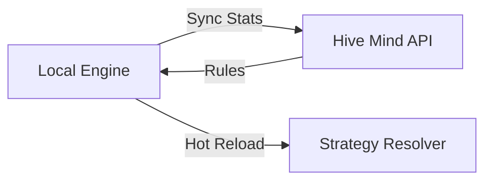

# 🐝 Engine: Hive Mind

The global intelligence synchronization layer. It connects the local engine to the BONGAS-AI Hive Mind network to pull down global optimization rules and share local performance insights.

---

## 🏗️ Synchronization Flow

---

## 🔑 Key Features

- **Global Intelligence**: Leverages patterns learned across the entire Baze ecosystem.
- **Auto-Approval**: Can automatically activate "Safe" rules designated by the Hive Mind.
- **Air-Gap Support**: Gracefully falls back to local strategies if the network is unavailable.

---
[⬅️ Back to Engine Main](../README.md)
