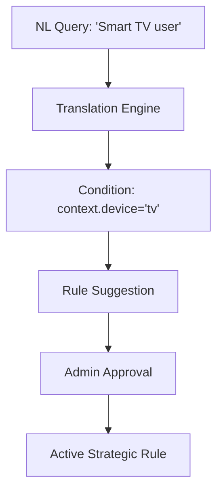

# 🤖 Engine: Suggestions Manager

The AI-driven brainstorming component. It translates natural language queries into executable strategic rules and manages the lifecycle of rule suggestions from the Analytics Sidecar.

---

## 🧠 Chatbot Translation Flow

---
[⬅️ Back to Engine Main](../README.md)
