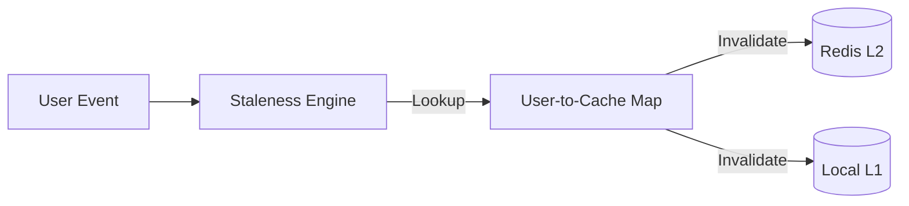

# 🔄 Engine: Staleness Engine

The real-time cache invalidation brain. It listens for user events (likes, playbacks, profile updates) and determines which cached recommendation rows are now "stale" and must be evicted.

---

## 🏗️ Invalidation Flow

---

## 🔑 Key Features

- **Event-Driven**: Immediate reaction to user behavioral changes.
- **Granular Eviction**: Can invalidate specific scenario rows without clearing the entire user cache.
- **Consistency**: Ensures the "Continue Watching" row is always up-to-date.

---

[🏠 Hub](../../../../../docs/HUB.md) | [🏠 Monitoring Main](../README.md) | [🔝 Top](#-engine-staleness-engine)
