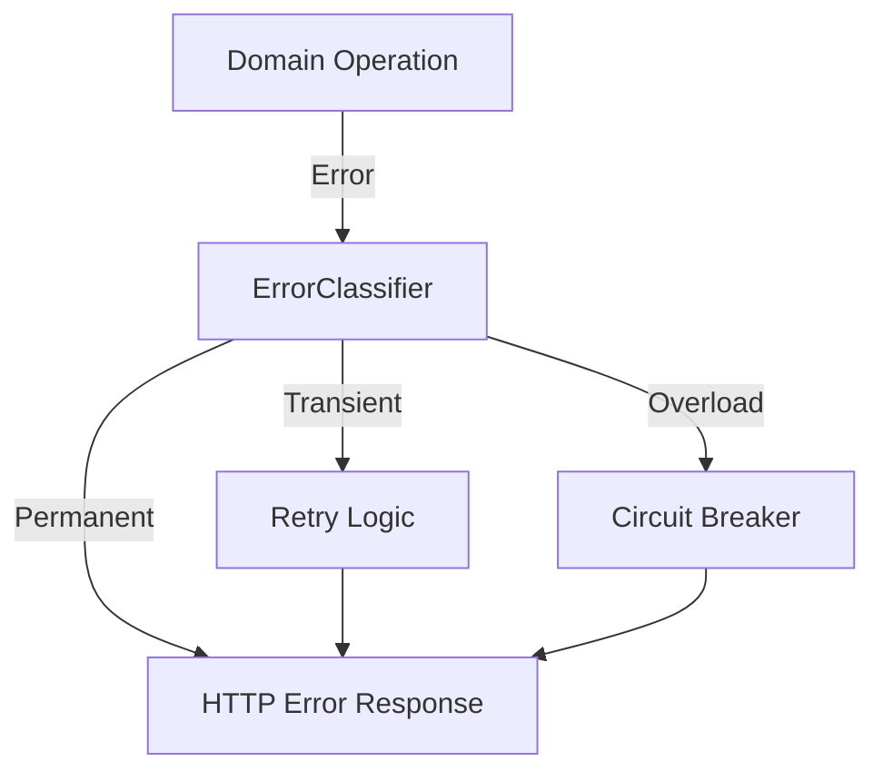

# 🚨 Error Management: Composite Resilience Pattern

> **Centralized error taxonomy and classification for resilient service operations.**

This module implements a layered error hierarchy that enables consistent error classification across all resilience components (circuit breaker, retry, bulkhead).

---

## 🏗️ Architecture

The error system is designed around the **Strategy Pattern**:

- **`ErrorClassification`**: The "What to do" (Transient, Permanent, Overload, etc.).
- **`ErrorClassifier`**: The "How to classify" trait implemented by domain errors.
- **`AppError`**: The **Composite** that aggregates all domain errors into a single type.

---

## 🧩 Sub-Modules

| Module | Description |
| :--- | :--- |
| [**🎯 Classification**](./classification/mod.rs) | Core classification logic and the `ErrorClassifier` trait. |
| [**⏳ Retry**](./retry/mod.rs) | Backoff strategies and retry hints for the resilience layer. |
| [**📑 Context**](./context/mod.rs) | Tracing and diagnostic information attached to errors. |
| [**🧱 Domain**](./domain/mod.rs) | Domain-specific error taxonomies (DB, Pipeline, ML, Security). |
| [**⚛️ Composite**](./composite/mod.rs) | The top-level `AppError` and Axum `IntoResponse` integration. |

---

## 🚀 Resilience Flow

---
[⬅️ Back to Source Root](../lib.rs)
