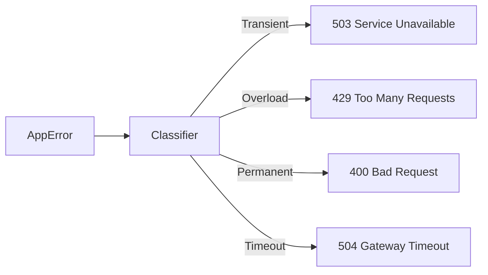

# ⚛️ Composite Error: Unified Application API

> **The integration layer between domain logic and the outside world.**

This module provides the `AppError` enum—the single unified error type for the entire application. It also handles the conversion of internal error states into meaningful HTTP responses for the API consumers.

---

## 🧩 Key Features

- **Unification**: Uses `#[from]` to automatically wrap all domain errors.
- **Classification Mapping**: Translates `ErrorClassification` into appropriate HTTP Status Codes (e.g., `Timeout` -> `504 Gateway Timeout`).
- **Axum Integration**: Implements `IntoResponse` for zero-boilerplate error propagation in web handlers.

---

## 🏗️ Response Mapping

---
[⬅️ Back to Error Main](../README.md)
