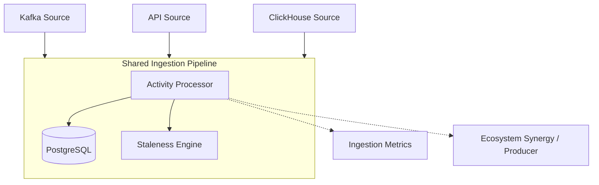

# 📥 Activity Ingestion Module

> **The high-throughput backbone for source-agnostic user activity processing.**

The Ingestion module is responsible for capturing user interactions from various sources (Kafka, API, ClickHouse) and funneling them into the BONGAS-AI engine. It ensures that activities are normalized, persisted, and used to drive real-time cache invalidation and ML training.

---

## 🏗️ Architecture Overview



---

## 🧩 Sub-Modules

| Module | Description |
| :--- | :--- |
| [**🏢 Manager**](./manager/README.md) | Lifecycle orchestrator for the entire ingestion pipeline. |
| [**⚙️ Processor**](./processor/README.md) | Core logic for normalizing and persisting activities. |
| [**📡 Sources**](./sources/README.md) | Source-specific adapters (Kafka, API, ClickHouse). |
| [**📦 Producer**](./producer/README.md) | Ecosystem synergy: broadcasting results to external systems. |
| [**📊 Metrics**](./metrics/README.md) | Real-time health and throughput monitoring. |
| [**🧬 Types**](./types/README.md) | Unified domain models for user activities. |

---

## 🚀 Quick Start

```rust
let mut manager = IngestionManager::new(config, pool, metrics, staleness, cb_registry, ...);

// Start all background workers
manager.start().await?;

// Aggregated health status
let health = manager.health().await;
```

---
[🏠 Back to Project Root](../../README.md)
